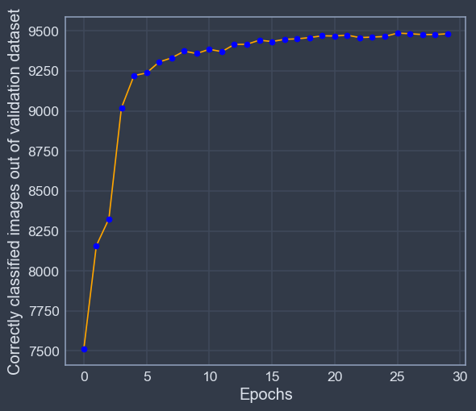
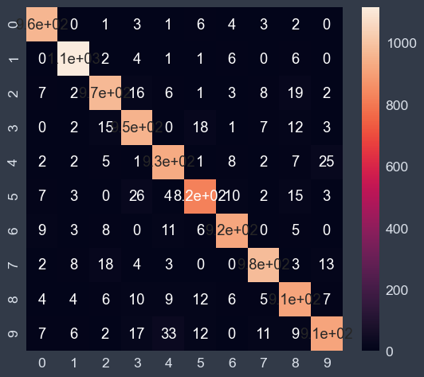

# Hand_Wriiten_Digit_Recongnizer_from_Scratch-Mnist_-Dataset-

**Methodology**

 ## 1. Used Data :-
   Here we have used the [MNIST](https://github.com/mnielsen/neural-networks-and-deep-learning/blob/master/data/mnist.pkl.gz) dataset that have 6,0000
   handwritten digits that we used for our training and another 1000 Datasets for our test.
 
 ## 2. Process :-
   **Step_1 :-**  First we have to import our data(downloaded from the given link) and then divide the datasets in two parts for training and testing our model.
   
   **Step_2 :-** Secondly,we have initialized some variables those will consists number of hidden layer, epochs,    batch_size,numbers of neurons in hidden layers.
   
   **Step_3 :-**: then we have done the main component of Neural network
   
   - Activation Function
   - Foreword pass
   - BackWard pass
   - Compute Accuracy
   - Updationg of weights
   - Training of model
   
   **2.1)  Activation Function :** 
   
      This function determines when theneurons will trigger or gets activated .Here we have used sigmoid and softmax(for output layer only).
   
   **2.2)Foreword pass :** 
   
    i) At first from input layer it takes first input and and multiply with randomly initialized weight and then
       use the sigmoid activation function and transfer the value to second layer(hidden layer-1) as a input
      
    ii) Then second layer also multiply it’s randomlyinitialized weight with the input and use sigmoid
        activation and transfer to hidden layer -2 
       
    iii) The hidden-2 layer also do same type of things and transfer to hidden 3 layer
    
    iv) Then in our hidden layer-3 we have used softmax to maximize our accuracy
  
  **2.3)Backward Pass :** In backward pass we have used a backpropagation algorithm , following this algorithm       we have updated the weight of every layer after every epoch. From the last layer to the first layer
  
    i) First we have calculated output error by calculating the difference between input and output.
    
    ii) Then after calculating error we have to update weights of every layer in backward direction
    
  **2.4)Stochastic Gradient Descent :**
  
    i) Here we split the data into mini batches according to the given batch size.so that every time we don’t
       have to iterate full dataset in every epoch.because when data is large it becomes costly.
    
    ii) it determines the gradient that says which direction we have to tune the weights to get
       minimum error
 **2.5)Accuracy :** 
 
    i) Here we have done a forward pass and a back pass and then take the maximum probable output
       and match with input then the mean of the prediction is the accuracy
 **2.6)Training and Testing of the model :**
 
     i)Train the neural network using mini-batch stochastic gradient descent
     
     ii)Here provided The ``training_data`` as a list of tuples
     
     iii)``(x, y)`` representing the training inputs and the desired outputs.
 **The other non-optional parameters are self-explanatory.**
    
    i) If ``test_data`` is provided then the Network will be evaluated against the test data after each epoch,and partial progress printed out. This is useful for tracking
        progress, but slows things down  substantially
        
        
 
 ## Result :   
 
 - Splitted Dataset :
  
  | No. of Training Samples  |  50000         |
  |--------------------------|----------------|
  |No. of cross VAl Samples  |  10000         |
  |                          |                |
  |No. of Testing Samples    |  10000         |
     
     
- Training and Testing result after per epoch : 

  | Results               |    Results                 |
  |-----------------------|----------------------------|
  |Epoch 0: 7512 / 10000  |Epoch 6: 9306 / 10000       |
  |Epoch 1: 8158 / 10000  |Epoch 7: 9332 / 10000       |
  |Epoch 3: 9020 / 10000  |Epoch 8: 9374 / 10000       |
  |Epoch 4: 9221 / 10000  |Epoch 9: 9359 / 10000       |
  |Epoch 5: 9238 / 10000  |Epoch 10: 9386 / 10000      |
  
**The result  accuracy will increase as per the number of eopchs will increase**
- Plot : **Epoch VS Correctly classified images in Validation set**

  
  
- Accracy : 94.62%

  |             Precision Score      |         Recall Score               |  F1 Score                    |
  |----------------------------------|------------------------------------|------------------------------|
  | 0.97959184    | 0.98237885       | 0.96192385       | 0.97379913      | 0.97067745   | 0.97807018    |
  | 0.9379845     | 0.94257426       | 0.94439024       | 0.92158761      | 0.94117647   | 0.9319628     |
  | 0.94602851    | 0.92152466       | 0.93179539       | 0.93515358      | 0.93885801   | 0.9282891     |
  | 0.95615866    | 0.95038911       | 0.96016771       | 0.96256158      | 0.958159     | 0.95643661    |
  | 0.93531828    | 0.90386521       | 0.92113246       | 0.94507772      |0.92817117    | 0.92401216    |
  
  
- Confusion Matrix: **Heatmap**

  
     

      
    

  
  
     

|  Status                    |
|----------------------------|
|                            |
| in Progress                |
|                            |
